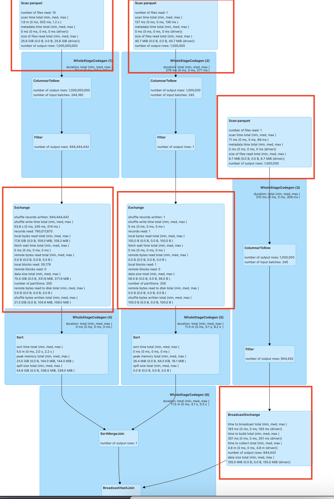
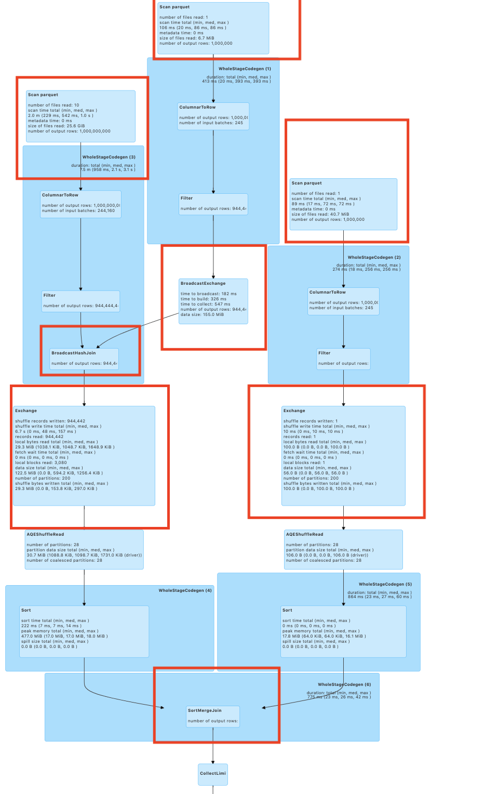

# spark-radiant Size based Join ReOrdering

Spark-Radiant SizeBasedJoinReOrdering works well for the Join which is of type star schema, where one table
consists of large number of records as compared to other tables and all the join condition of smaller table with
a large table. Spark by default perform join left to right(whether its SMJ before the BHJ or vice versa).
This optimizer rule performs the join smaller table join first before the bigger table(BHJ first before the SMJ.)

## Where SizeBasedJoinReOrdering Works?

1) This works with Inner Join.
2) There is Star Schema in the join Pattern

## Performance Improvement Factors

**Improved Network Utilization:**
SizeBasedJoinReOrdering performs BHJ before SMJ , hence reduces the number of records involved in the join
operation and this helps in reducing the shuffle data generated and minimizes Network I/O.

**Improved Resource Utilization:**
The number of records involved in the join is reduced as the result of using the SizeBasedJoinReOrdering in spark.This
reduces the system resource requirements since the number of tasks spawned for the Join operation is reduced.
This results in the completion of jobs with lower number of resources.

````

Regular Join                               |    SizeBasedJoinReordering
                                           |
                                           |  
                                           |
                     BHJ Join              |                SMJ Join 
                     /     \               |                /     \
                SMJ Join   Filter          |           BHJ Join   Table2 
                 /  \           \          |             /  \        
            Table1    Table2   Table3      |         Table1  Filter
                                           |                   \
                                           |                   Table3  
                                           |
````


## Regular Join

```
val df = spark.sql("select * from t,t2, t1  where t._1=t1._1 and t._2 = t1._2 and t._1=t2._1 
and t1._2 > 'value15' and t2._3 = 'value019'")
df.show 
```




## SizeBasedJoinReOrdering

```
val df = spark.sql("select * from t,t2, t1  where t._1=t1._1 and t._2 = t1._2 and t._1=t2._1 
and t1._2 > 'value15' and t2._3 = 'value019'")
df.show 
```



#### SizeBasedJoinReOrdering join works 4X faster than the regular Spark Join for this query.

## How SizeBasedJoinReOrdering works?
Importing the rule for SizeBasedJoinReOrdering on the catalyst optimizer of the Apache Spark

## Config Tuning for SizeBasedJoinReOrdering in Spark

1) **spark.sql.support.sizebased.join.reorder** - Config to add the support of SizeBasedJoinReOrdering for the sql queries.
   The default value is true.
2) **spark.sql.support.sbo.smj** - Config to add the support of SizeBasedJoinReOrdering for the sql queries 
    when all the join is not BHJ, only SMJ.The default value is false.This will work with spark-radiant-1.0.4.

## Running SizeBasedJoinReOrdering in Spark
Provide the jar spark-radiant-sql-1.0.3.jar in the class path for the spark Application. For eg using --jars etc.

or

using --packages -> for jars(spark-radiant-sql-1.0.3.jar) published to maven central

```
./bin/spark-shell --packages "io.github.saurabhchawla100:spark-radiant-sql:1.0.3"

./bin/spark-submit
--packages "io.github.saurabhchawla100:spark-radiant-1.0.3"
--class com.test.spark.examples.SparkTestDF /spark/examples/target/scala-2.12/jars/spark-test_2.12-3.1.1.jar

```

### 1) Importing the rule for SizeBasedJoinReOrdering on the catalyst optimizer of the Apache Spark

```
import com.spark.radiant.sql.api.SparkRadiantSqlApi
// adding Extra optimizer rule
val sparkRadiantSqlApi = new SparkRadiantSqlApi()
sparkRadiantSqlApi.addOptimizerRule(spark)

```

### 2) Importing the rule for SizeBasedJoinReOrdering on the catalyst optimizer of the Apache Spark in pyspark
```
./bin/pyspark --packages io.github.saurabhchawla100:spark-radiant-1.0.3

// Importing the extra Optimizations rule
>>> from sparkradiantsqlpy import SparkRadiantSqlApi
>>> SparkRadiantSqlApi(spark).addExtraOptimizerRule()

or 

>>> spark._jvm.com.spark.radiant.sql.api.SparkRadiantSqlApi().addOptimizerRule(spark._jsparkSession)
```

### 3) Importing the rule for SizeBasedJoinReOrdering on the catalyst optimizer of the Apache Spark
```
./bin/spark-shell --packages "io.github.saurabhchawla100:spark-radiant-sql:1.0.3"
--conf spark.sql.extensions=com.spark.radiant.sql.api.SparkRadiantSqlExtension

./bin/spark-submit
--packages "io.github.saurabhchawla100:spark-radiant-1.0.3"
--conf spark.sql.extensions=com.spark.radiant.sql.api.SparkRadiantSqlExtension
--class com.test.spark.examples.SparkTestDF /spark/examples/target/scala-2.12/jars/spark-test_2.12-3.1.1.jar

```

Note - Will add few more optimization in near future.
1) ReOrder the Join by having the join condition with Partition column first compared to Non Partition column condition
