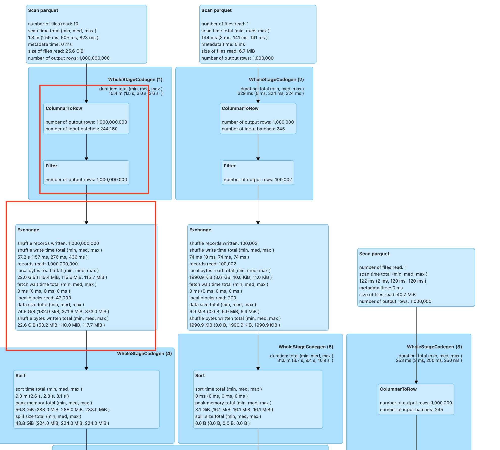
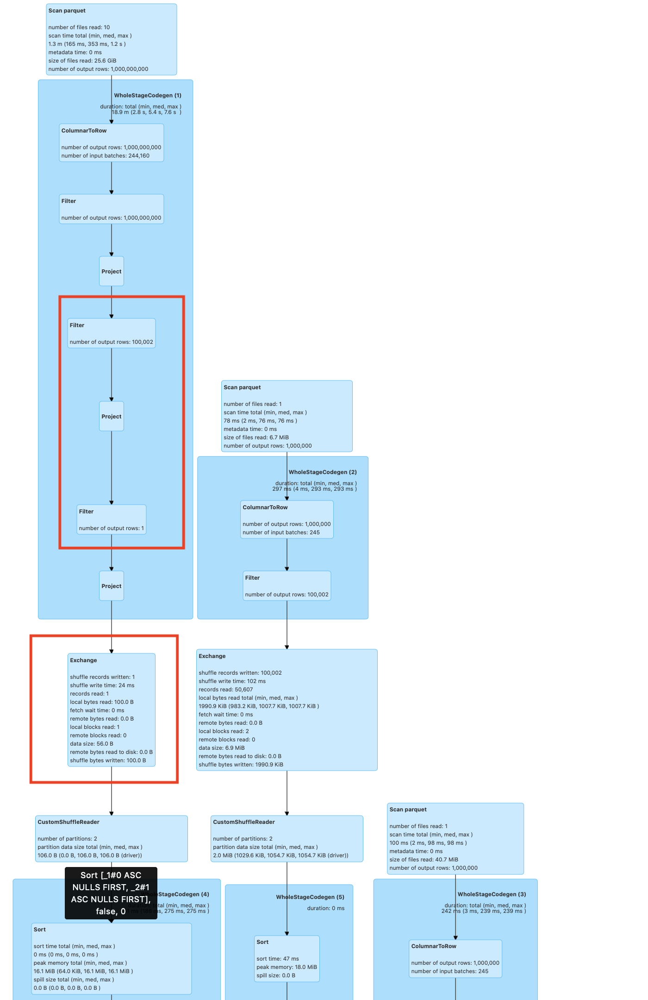

# spark-radiant Dynamic Filtering

Spark-Radiant Dynamic Filter works well for the Join which is a type of star schema, where one table consists of
large number of records as compared to other tables. This Dynamic Filtering works on runtime by using the predicates
from the smaller table and filter out the join columns from the smaller table used those predicates result
on the bigger table and filter out the bigger table, resulting in the less expensive join. Since the number of 
records on the left side is reduced resulting in improving the performance of the Spark Sql Queries.

````

Regular Join
                                           |
Scenario 1                                 |   Scenario 2
                                           |
                       Join                |                  Join
                     /     \               |                /     \
                Table1     Filter          |            Table1    Table2
                              \            |
                              Table2       |


Dynamic Filter Join

                                           |
Scenario 1                                 |   Scenario 2
                Join                       |                   Join
              /      \                     |                /       \
   DynamicFilter     Filter                |       DynamicFilter   Table2
        /              \                   |              /
   Table1              Table2              |         Table1

````

## Where Dynamic Filtering Works?

1) This works with Inner Join, Right outer join, Left semi join, Left outer join and Left Anti join.
2) This works when there is no Broadcast Hash Join Strategy is used.
3) This works for equi-join conditions.   
4) This works when we get the filter records from the smaller table within the threshold limit for completion.

## Performance Improvement Factors

**Improved Network Utilization:**
Dynamic filter reduces the number of records involved in the join operation and this helps in reducing
the shuffle data generated and minimizes Network I/O.

**Improved Resource Utilization:**
The number of records involved in the join is reduced as the result of using the Dynamic Filtering in spark.This
reduces the system resource requirements since the number of tasks spawned for the Join operation is reduced.
This results in the completion of jobs with lower number of resources.

**Improved Disk I/O :**
Push down the dynamic filter to the FileSourceScan / Datasource to read only the filter records.
This will reduce the pressure on the Disk I/O.

## Regular Join

```
val df = spark.sql("select * from table,table1,table2 where table._1=table1._1 and table._1=table2._1 
 and table1._3 <= 'value019' and table2._3 = 'value015'")
df.show 
```




## DynamicFilter Join

```
val df = spark.sql("select * from table,table1,table2 where table._1=table1._1 and table._1=table2._1 
 and table1._3 <= 'value019' and table2._3 = 'value015'")
df.show
```



#### Dynamic filter join works 8X faster than the regular Spark Join for this query.

## How Dynamic Filtering works?
1) Create the optimized DataFrame from the existing DataFrame
2) Importing the rule for Dynamic Filter on the catalyst optimizer of the Apache Spark

## Config Tuning for Dynamic Filtering in Spark

1) spark.sql.dynamicFilter.bloomFilter.size - We have used BloomFilter to store the Dynamic Filter result. This conf is
   used to create the bloomFilter based on the user requirement. By default value is 10000000L.

2) spark.sql.dynamicFilter.completion.threshold - This is the time to complete the dynamic filter optimization in spark.
   This is to prevent the scenario where the smaller table where predicates filtering is huge and not completed in threshold
   time. Its value is in seconds. The default value is 60.

3) spark.sql.dynamicFilter.pushdown.threshold - This is the default value for pushdown of the dynamic filter to 
   FileScan / DataSource scan. The default value is 5000

## Running Dynamic Filter in Spark
Provide the jar spark-radiant-sql-1.0-SNAPSHOT.jar in the class path for the spark Application. For eg using --jars etc.

### 1) Create the optimized DataFrame from the existing Dataframe
Use the below code to create the optimized data frame.
```
import com.spark.radiant.sql.api.SparkRadiantSqlApi
val df2 = df1.join(df2, Seq("joinCond"), "inner")
// using the Dynamic Filter
val sparkRadiantSqlApi = new SparkRadiantSqlApi()
// optimized df3 with Dynamic Filter
val df3 = sparkRadiantSqlApi.optimizeDataFrame(sparkSession, df2)
```

### 2) Importing the rule for Dynamic Filter on the catalyst optimizer of the Apache Spark

```
// Importing the extra Optimizations rule
spark.experimental.extraOptimizations=Seq(com.spark.radiant.sql.catalyst.optimizer.DynamicFilterOptimizer)
val df2 = df1.join(df2, Seq("joinCnd"), "inner")
// df2 will have the dynamic filter
df2.show()
```

Note - Will add few more optimization in near future.
