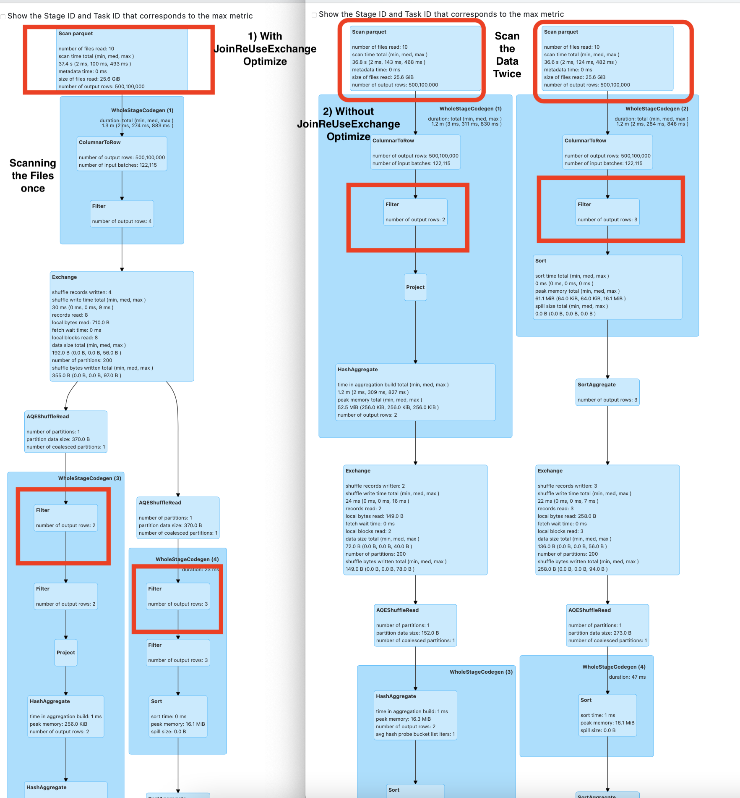

# spark-radiant 1.0.4 Release Notes

a) **Support for Spark 3.2** - Spark-Radiant 1.0.4 has default version of Apache Spark as Spark-3.2.1. The published maven jar is 
   having the dependency for spark-3.2.1. For using the lower version of spark(3.1.x) with spark-radiant. There is need to build the
   spark-radiant with spark 3.1.x. Profile for spark 3.1 is already supported.
   
   Use the below command to build with spark-3.1.x
   
   `mvn clean install -DskipTests -Pspark31 / mvn clean package -DskipTests -Pspark31`
   
   
b) **Improvement in Metrics Collector** - There are some new features and improvement added in the Metrics collector
   for the spark-radiant 1.0.4.
   1) Add the support for providing the compute recommendation for the executors capacity.
   2) Provide the information of the Job ID, for the Stage level metrics.
   3) User can also Publish the metrics by their own custom Publisher class by extending the **org.apache.spark.PublishMetrics** interface
      and override the publishStageLevelMetrics method. SamplePublishMetrics class already added in project for reference and there 
      is need to provide the custom Publish class name in this conf while running the spark Application.
      `--conf spark.radiant.metrics.publishClassName=com.spark.radiant.core.SamplePublishMetrics`
   
   ```  
       *****Stage Info Metrics*****
       ***** Stage Info Metrics Stage Id:0 *****
       {
       "Job Id":"0",
       "Stage Id":"0",
       "Final Stage Status":"succeeded",
       "Number of Task":"10",
       "Total Executors ran to complete all Task":"2",
       "Stage Completion Time":"858 ms",
       "Stage Completion Time Recommendation":"With 2x executors(4), time to complete stage 366 ms.
        With 4x executors(8), time to complete stage 183 ms.",
       "Average Task Completion Time":"139 ms"
       "Number of Task Failed in this Stage":"0"
       "Few Skew task info in Stage":"Skew task in not present in this stage"
       "Few Failed task info in Stage":"Failed task in not present in this stage"
       }
   ```    

 c) **JoinReuseExchangeOptimizeRule** - JoinReuseExchangeOptimizeRule works for scenario where
      there is join between same table and the scan of table happens multiple times.After Applying this rule File Scan
      will take place once.
      Please refer the spark Plan execution 
      
      
       This feature is enabled using `--conf spark.sql.optimize.join.reuse.exchange.rule=true`
       There is need to add this conf for adding this rule in Sql Extension
       `--conf spark.sql.extensions=com.spark.radiant.sql.api.SparkRadiantSqlExtension`
      
       spark.sql("""select * from
       (select col_1, count(col_1) count from table1 where col_2 in ('value0', 'value09') group by col_1) a,
       (select col_1, max(col_2) max from table1 where col_2 in ('value0', 'value1', 'value119') group by col_1) b where a.col_1=b.col_1""")```
                 
  **JoinReuseExchangeOptimizeRule works 2X faster than the regular Spark Join for this query.**
     

d) **Improvement in Size based Join Reordering**  
        
   1) Support for Size based Join Reordering added between the two Sort Merge Join. Smaller table Sort Merge Join
      is executed before the bigger table Sort Merge Join.
   2) **spark.sql.support.sbo.smj** - Config to add the support of SizeBasedJoinReOrdering for the sql queries 
       when all the join is not BHJ, only SMJ.The default value is false.This will work with spark-radiant-1.0.4.
   3) Size based Join Reordering support is available in scala, pyspark, spark-sql, Java, R using the conf 
     `--conf spark.sql.extensions=com.spark.radiant.sql.api.SparkRadiantSqlExtension`.
